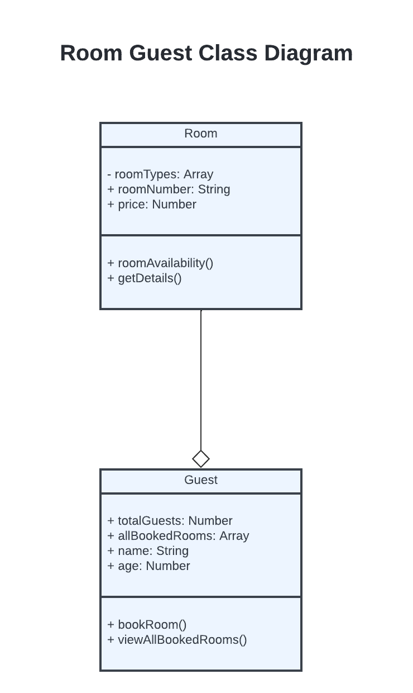
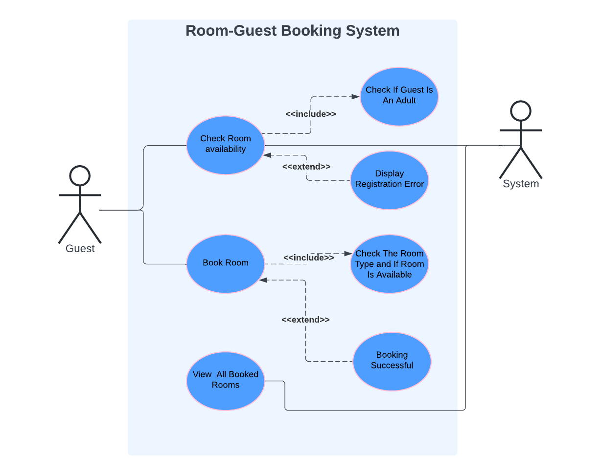
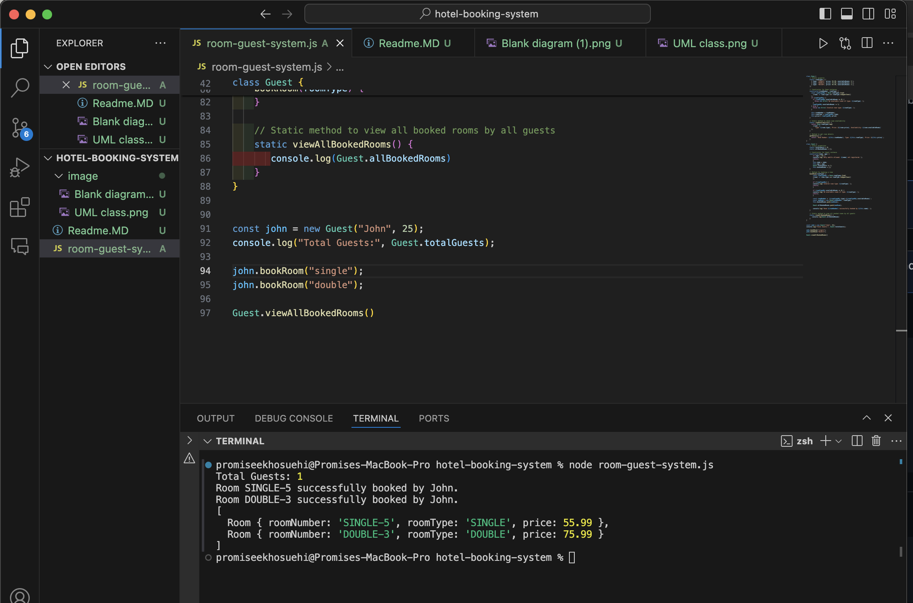

# Title: Room-Guest Management System

## Description:
This system facilitates room bookings and tracks room availability. Guests can check room availability, book rooms, and view details of all booked rooms. The system efficiently manages room data and ensures a seamless booking experience.

## UML Class Diagram

## UML Use Case

## Code Output

